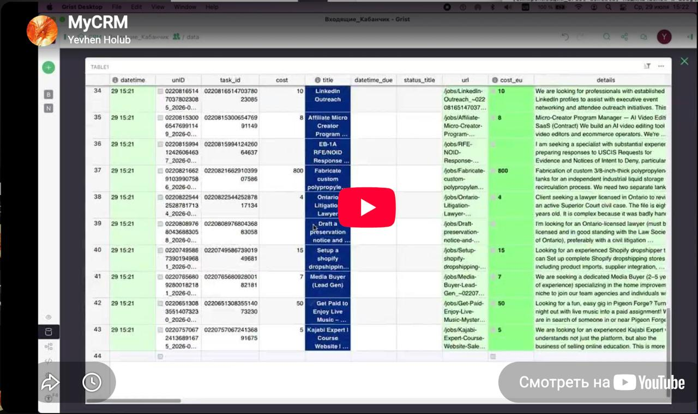

# Yevhen Holub

## Hi, I'm a Python Developer focused on Automation and AI-Assisted Development

**📄 [Resume (PDF)](CV_Yevhen_Holub_2026-08-01.docx.pdf)**

📞 [+34 607 197 431](tel:+34607197431) · ✉️ [psytaktikscout@gmail.com](mailto:psytaktikscout@gmail.com) · [Telegram](https://t.me/YevhenHolub) · [WhatsApp](https://wa.me/34607197431) · [LinkedIn](https://www.linkedin.com/in/yevhen-holub/) · [GitHub](https://github.com/PsyTaktikScout)

I build practical tools that automate workflows, connect services, process data, and turn ideas into working systems.

My development journey began with Pascal and Delphi, later included C++, MQL4, and Python. Python has been my main tool for the last several years.

## What I work with

* **Python** — automation, data processing, integrations, and tooling
* **API integrations** — Telegram, Google Sheets, Grist, and other external services
* **LLM applications** — practical workflows around LLM APIs, agent-based pipelines, multi-provider integrations
* **AI-assisted development** — specification-driven workflows with coding agents; responsible for architecture, code review, testing, debugging, and integration
* **Tooling** — basic Git, basic Docker (can containerize and run applications)

## Selected projects

### MyCRM Ecosystem

A collection of interconnected tools built around a real workflow: task monitoring, data synchronization, LLM-based evaluation, Telegram notifications, and long-running process supervision.

### Task Atomizer

An experimental multi-agent system that transforms broad requests into smaller, actionable tasks. It explores task decomposition, uncertainty detection, clarification workflows, agent orchestration, multi-model integration, and failure handling.

### Other Automation Tools

Projects involving rental monitoring, web data collection, asynchronous processing, browser extensions, and workflow support.

## How I work

I start by understanding the practical problem, break it into testable parts, design an appropriate solution, and iterate through testing and real use.

AI is part of my development workflow—not a replacement for understanding the problem or taking responsibility for the result.

## Interested in

Python development · Business process automation · AI and LLM integrations · Agent-based systems · API integrations · Internal tools · Rapid prototyping

**Open to remote opportunities and collaboration.**

### Portfolio

**MyCRM Ecosystem** — 8 interconnected tools for freelance automation (Kabanchik.ua+):

| Project | Description |
|---------|-------------|
| [**MyCRM_parser**](https://github.com/PsyTaktikScout/MyCRM_parser) | Kabanchik.ua task monitor with Telegram + Grist sync |
| [**MyCRM_Grist_GSheets_Sync**](https://github.com/PsyTaktikScout/MyCRM_Grist_GSheets_Sync) | One-way Grist → Google Sheets sync with cell-level diff |
| [**MyCRM_tasks_archiver**](https://github.com/PsyTaktikScout/MyCRM_tasks_archiver) | Export Grist records to CSV archives with auto-delete |
| [**MyCRM_tasks_input_to_sheets**](https://github.com/PsyTaktikScout/MyCRM_tasks_input_to_sheets) | Sync PageDataSaver JSON data into Grist |
| [**MyCRM_assessment_attractiveness_tasks**](https://github.com/PsyTaktikScout/MyCRM_assessment_attractiveness_tasks) | 4-stage LLM pipeline for freelance task scoring (Grist + GSheets) |
| [**MyCRM_ObkhodKabanchika**](https://github.com/PsyTaktikScout/MyCRM_ObkhodKabanchika) | Async crawler + 5-stage LLM evaluation pipeline |
| [**MyCRM_PageDataSaver**](https://github.com/PsyTaktikScout/MyCRM_PageDataSaver) | Chrome MV3 extension for automatic web data collection |
| [**MyCRM_ProcessRestarter**](https://github.com/PsyTaktikScout/MyCRM_ProcessRestarter) | Adaptive supervisor for long-running Python processes |

| Project | Description |
|---------|-------------|
| [**task-atomizer**](https://github.com/PsyTaktikScout/task-atomizer) | LangGraph task decomposition engine with multi-LLM failover (Groq, OpenAI, Ollama) |
| [**spain-rental-monitor**](https://github.com/PsyTaktikScout/spain-rental-monitor) | Spanish property scraper with price tracking and Telegram alerts |
| [**tg_bot_crm2**](https://github.com/PsyTaktikScout/tg_bot_crm2) | AI-assisted Telegram CRM bot for freelance client management |
| [**LandingWebDevYevhenHolub**](https://github.com/PsyTaktikScout/LandingWebDevYevhenHolub) | Portfolio landing page — HTML/CSS |
